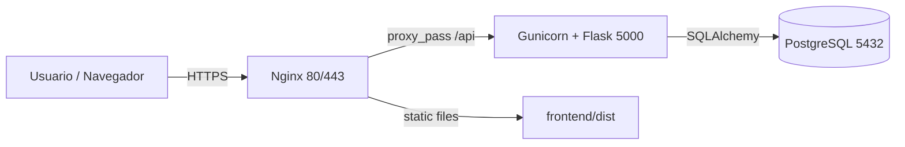

# Informe técnico: EVA - Ambiente Virtual de Aprendizaje
 
## 1. Diseño de la infraestructura
 

 
**Componentes:**
 
- **VPS Linux** (Ubuntu LTS): hospeda todo el stack.
- **Nginx**: servidor web, termina TLS, sirve archivos estáticos del frontend y actúa como proxy inverso hacia Gunicorn.
- **Gunicorn**: servidor WSGI que ejecuta la aplicación Flask.
- **Flask**: API REST con autenticación JWT, control de acceso basado en roles y ORM SQLAlchemy.
- **PostgreSQL**: base de datos relacional persistente.
- **React SPA**: frontend compilado en `frontend/dist`.
 
## 2. Proceso de provisionamiento
 
1. Crear un VPS con Ubuntu, asignar IP y dominio (opcional).
2. Actualizar el sistema: `apt update && apt upgrade -y`.
3. Instalar paquetes base: `python3 python3-venv python3-pip postgresql postgresql-contrib nginx git ufw`.
4. Crear usuario `eva` y directorio `/opt/eva-universidad`.
5. Clonar el repositorio.
6. Crear base de datos `evadb` y usuario `evauser`.
7. Configurar entorno: `DATABASE_URL`, `SECRET_KEY`, `JWT_SECRET_KEY`.
8. Crear virtualenv, instalar dependencias y ejecutar `flask db upgrade`.
9. Construir el frontend: `npm install && npm run build`.
10. Instalar servicio systemd para Gunicorn (`deploy/gunicorn.service`).
11. Configurar Nginx (`deploy/nginx.conf`) y habilitar SSL con Certbot.
12. Configurar UFW: permitir 22, 80, 443.
 
## 3. Configuración del pipeline CI/CD
 
El pipeline se encuentra en `.github/workflows/deploy.yml`.
 
**Jobs:**
 
1. **test**: instalar dependencias Python, ejecutar pytest.
2. **build**: instalar dependencias Node, compilar frontend con `npm run build`.
3. **deploy**: conectar por SSH al VPS, hacer `git fetch` + `git reset --hard origin/main`, actualizar dependencias, ejecutar migraciones y reiniciar Gunicorn/Nginx.
 
Secrets requeridos: `VPS_HOST`, `VPS_USER`, `VPS_SSH_KEY`, `VPS_PORT`.
 
## 4. Plan de mantenimiento y seguridad
 
### Respaldo
 
- `deploy/backup.sh` realiza `pg_dump` diario y conserva los últimos 7 días.
- Programar en cron: `0 3 * * * /opt/eva-universidad/deploy/backup.sh`.
 
### Seguridad
 
- Usar variables de entorno para secretos (nunca en el código).
- JWT con expiración de 24 h.
- Contraseñas hasheadas con Werkzeug.
- Roles restringidos: estudiante solo ve cursos matriculados; profesor solo administra sus cursos; administrador gestiona usuarios y roles.
- Firewall UFW con acceso limitado a SSH, HTTP y HTTPS.
- Nginx limita tamaño de cuerpo y cabeceras.
 
### Mantenimiento
 
- Aplicar `apt upgrade` periódicamente.
- Revisar logs: `journalctl -u eva-universidad` y `/var/log/nginx/error.log`.
- Actualizar dependencias y auditar con `npm audit` / `pip-audit`.